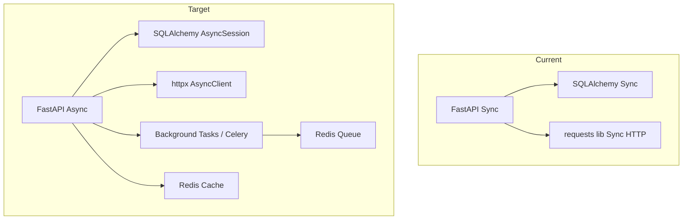

# FinanceTracker — Strategic Development Roadmap

> **Objective**: Evolve from a personal project into a product capable of supporting **1,000+ active users**

---

## 1. Current Project Assessment

### What It Does
FinanceTracker is a personal finance tracking app with three interfaces:
- **Web Dashboard** — Alpine.js SPA (glassmorphism dark UI) served via FastAPI, with record CRUD, income/expense charts, and Monobank card management
- **Telegram Bot** — auto-registering bot that parses natural-language messages (e.g. `50 Coffee EUR`) into financial records
- **Monobank Integration** — connects to Monobank API to import cards and transactions

### Problems It Solves
- Manual income/expense tracking with multi-currency support (USD, EUR, UAH)
- Bank data aggregation from Monobank (Ukraine's largest neobank)
- Quick transaction logging via Telegram without opening a browser

### Strengths

| Area | Details |
|------|---------|
| **Architecture** | Clean layered pattern: Router → Service → Repository → Model. Follows separation of concerns. |
| **Auth** | JWT-based authentication with Argon2 password hashing (via `pwdlib`). Telegram WebApp auth with HMAC signature validation. |
| **Frontend** | Premium glassmorphism design with `Outfit` font, Chart.js charts, Alpine.js reactivity, skeleton loaders, toast notifications. Well above MVP quality. |
| **Deployment** | Dockerized with `docker-compose`, Alembic migrations, and a migration entrypoint script. |
| **Data Model** | UUIDs for all PKs, proper foreign keys, cascading deletes on Mono transactions. |

### Weaknesses & Technical Risks

> [!CAUTION]
> **Secrets exposed**: The [.env](file:///Users/ivanprocenko/FinanceTracker/.env) file contains live secrets (JWT key, Telegram bot token, Monobank token, database credentials) and is committed to the repository. This is a **critical security vulnerability**.

| Issue | Severity | Location |
|-------|----------|----------|
| **Secrets in [.env](file:///Users/ivanprocenko/FinanceTracker/.env) committed to git** | 🔴 Critical | [.env](file:///Users/ivanprocenko/FinanceTracker/.env) |
| **Default `SECRET_KEY` fallback** in auth service | 🔴 Critical | [auth_service.py](file:///Users/ivanprocenko/FinanceTracker/src/services/auth_service.py#L10) |
| **Synchronous `requests`** for Monobank API calls (blocks the event loop) | 🟠 High | [mono.py service](file:///Users/ivanprocenko/FinanceTracker/src/services/mono.py#L74) |
| **No `created_at` / `updated_at` timestamps** on [Record](file:///Users/ivanprocenko/FinanceTracker/src/models/record.py#7-15) model | 🟠 High | [record.py model](file:///Users/ivanprocenko/FinanceTracker/src/models/record.py) |
| **[sync_transaction](file:///Users/ivanprocenko/FinanceTracker/src/services/mono.py#137-139) is a no-op** ([pass](file:///Users/ivanprocenko/FinanceTracker/src/services/auth_service.py#18-21) body) | 🟡 Medium | [mono.py:138](file:///Users/ivanprocenko/FinanceTracker/src/services/mono.py#L138) |
| **[Savings](file:///Users/ivanprocenko/FinanceTracker/src/models/savings.py#7-13) model exists but unused** — no service, router, or frontend | 🟡 Medium | [savings.py](file:///Users/ivanprocenko/FinanceTracker/src/models/savings.py) |
| **Hardcoded bot URL** to Cloudflare tunnel (changes every restart) | 🟡 Medium | [bot.py:20](file:///Users/ivanprocenko/FinanceTracker/src/bot/bot.py#L20) |
| **No duplicate detection** when importing Mono transactions | 🟡 Medium | [mono.py:110-119](file:///Users/ivanprocenko/FinanceTracker/src/services/mono.py#L110) |
| **CORS allows all origins** (`allow_origins=["*"]`) | 🟡 Medium | [main.py:19](file:///Users/ivanprocenko/FinanceTracker/src/main.py#L19) |
| **Telegram router not registered** in [main.py](file:///Users/ivanprocenko/FinanceTracker/src/main.py) | 🟡 Medium | [main.py](file:///Users/ivanprocenko/FinanceTracker/src/main.py) |
| **Password sent as query param** during signup | 🟡 Medium | [app.js:178](file:///Users/ivanprocenko/FinanceTracker/frontend/app.js#L178) |
| **Bot service is commented out** in [docker-compose.yml](file:///Users/ivanprocenko/FinanceTracker/docker-compose.yml) | 🟡 Medium | [docker-compose.yml:17](file:///Users/ivanprocenko/FinanceTracker/docker-compose.yml#L17) |
| **Only 1 test file** (Telegram auth logic only) | 🟢 Low | [tests/](file:///Users/ivanprocenko/FinanceTracker/tests/) |
| **Hardcoded exchange rates** on frontend | 🟢 Low | [app.js:8-12](file:///Users/ivanprocenko/FinanceTracker/frontend/app.js#L8) |
| **[TelegramService](file:///Users/ivanprocenko/FinanceTracker/src/bot/service/service.py#9-15) class is empty** | 🟢 Low | [service.py](file:///Users/ivanprocenko/FinanceTracker/src/bot/service/service.py) |

---

## 2. Target Vision (Point B)

### Core Product Value
**A personal finance command center** that unifies manual tracking, bank import, and intelligent insights — accessible via web, Telegram, and (eventually) mobile.

### Main User Personas

| Persona | Description | Key Need |
|---------|-------------|----------|
| 🧑‍💻 **Tech-Savvy Individual** | Ukrainian 20–35 y/o using Monobank, comfortable with bots | Automatic transaction import + quick Telegram logging |
| 📊 **Budget-Conscious Planner** | Anyone wanting to control spending | Category-based budgets, spending limits, alerts |
| 💱 **Multi-Currency User** | Freelancer/traveler earning in EUR/USD, spending in UAH | Accurate multi-currency tracking with real-time rates |

### Key Use Cases
1. Connect Monobank → auto-import all transactions → see categorized spending
2. Log a quick expense via Telegram during lunch → see it on the dashboard instantly
3. Set a monthly budget for "Food" → get notified when approaching the limit
4. View monthly income vs expenses → identify savings potential
5. Track savings goals (car, vacation, emergency fund) → monitor progress

### Competitive Features for Maturity
- **Auto-categorization** using AI (or rule-based mapping from Mono's MCC codes)
- **Budget alerts** via Telegram or push notifications
- **Recurring transaction detection** (rent, subscriptions)
- **Export reports** (PDF/CSV) for accounting
- **Multi-bank support** (Monobank + PrivatBank or generic CSV import)

---

## 3. Feature Gap Analysis

### Missing SaaS Essentials

| Feature | Current State | Impact |
|---------|--------------|--------|
| **Email verification** | None — users sign up with unverified emails | Users could squatter emails |
| **Password reset** | Not implemented | Users get locked out permanently |
| **Session management** | Token expires silently; no refresh token | Poor UX — users must re-login every 30 min |
| **User profile / settings page** | None | Can't change name, email, or manage account |
| **Data export** (CSV/PDF) | None | Users can't backup or use data externally |
| **Onboarding flow** | None — users land on an empty dashboard | Low activation & retention |

### Usability Gaps

| Feature | Details |
|---------|---------|
| **Transaction categories** | Records have only a free-text description — no structured categorization |
| **Date selector on records** | Records lack `created_at`; no way to add past-dated entries |
| **Search & sort** | No search by description, date range, or amount range |
| **Pagination** | All records loaded at once — will break at scale |
| **Mobile responsiveness** | Not fully tested — nav may break on small screens |
| **PWA support** | No `manifest.json`, no service worker — can't "install" on phone |

### AI Capabilities (Currently None)

| Feature | Opportunity |
|---------|------------|
| **Auto-categorization** | Map Mono MCC codes or use NLP on descriptions to assign categories |
| **Spending insights** | "You spent 40% more on food this month than your average" |
| **Smart Telegram parsing** | Handle multi-word descriptions, detect currency from context |

### Scalability & Reliability

| Feature | Details |
|---------|---------|
| **Async DB operations** | Currently uses synchronous SQLAlchemy — won't scale with FastAPI |
| **Connection pooling** | No pool configuration on the engine |
| **Rate limiting** | No API rate limiting — vulnerable to abuse |
| **Background jobs** | No task queue for Mono sync (API has rate limits of 1 req/min) |
| **Health check endpoint** | Only DB healthcheck in docker-compose, no app-level `/health` |
| **Error tracking** | No Sentry or equivalent integrated |

---

## 4. High-Impact Features for Growth

### Feature 1: Transaction Categories & Budgets
- **Why it matters**: Core value prop — knowing WHERE money goes, not just how much
- **Problem solved**: Users can't analyze spending by category (food, transport, subscriptions)
- **Complexity**: 🟡 Medium — new `Category` model, budget tracking, frontend category picker, charts by category

### Feature 2: Auto-Import & Sync with Mono (Background Job)
- **Why it matters**: Manual "Add Transactions" button is friction; users want set-and-forget
- **Problem solved**: [sync_transaction](file:///Users/ivanprocenko/FinanceTracker/src/services/mono.py#137-139) is currently a no-op; no deduplication; blocks on API
- **Complexity**: 🟡 Medium — implement background scheduler (APScheduler/Celery), add dedup via Mono's [id](file:///Users/ivanprocenko/FinanceTracker/src/repositories/user.py#12-14) field, handle rate limits

### Feature 3: Refresh Tokens + Session Persistence
- **Why it matters**: 30-minute token expiry forces re-login, which kills daily usage
- **Problem solved**: Users abandoning the app because they keep getting logged out
- **Complexity**: 🟢 Low — add refresh token endpoint, store in httpOnly cookie, auto-refresh on 401

### Feature 4: PWA Support (Installable Web App)
- **Why it matters**: Most finance tracking happens on mobile; PWA turns the web app into a phone app
- **Problem solved**: Users have to remember a URL instead of tapping an icon
- **Complexity**: 🟢 Low — add `manifest.json`, service worker for offline support, app icons

### Feature 5: Spending Insights Dashboard
- **Why it matters**: Raw data isn't useful; users want automated analysis
- **Problem solved**: "Am I spending more than last month?" — no way to answer this currently
- **Complexity**: 🟡 Medium — backend aggregation endpoints, trend analysis, week-over-week/month-over-month comparisons

### Feature 6: Multi-Bank CSV Import
- **Why it matters**: Limits user base to Monobank users only
- **Problem solved**: PrivatBank, international banks, or any source can contribute data
- **Complexity**: 🟡 Medium — CSV upload endpoint, configurable column mapping, file validation

### Feature 7: Telegram Bot Enhancements (Inline Buttons, Reports)
- **Why it matters**: Telegram is the fastest input method; making it smarter increases retention
- **Problem solved**: Current bot only parses simple messages; no way to view balance or get reports
- **Complexity**: 🟡 Medium — inline keyboards for categories, `/balance` command, weekly summary

### Feature 8: Onboarding & Empty-State Guidance
- **Why it matters**: New users who see an empty dashboard leave within 30 seconds
- **Problem solved**: No guidance on what to do first (add record? connect Mono? link Telegram?)
- **Complexity**: 🟢 Low — step-by-step first-run wizard, contextual tooltips, empty-state CTAs

---

## 5. Development Roadmap (3–6 Months)

### Phase 1: Stabilization & Critical Fixes (Weeks 1–4)

#### Security & Infrastructure
- [ ] **Rotate all exposed secrets** (JWT key, bot token, Mono token, DB credentials)
- [ ] Add [.env](file:///Users/ivanprocenko/FinanceTracker/.env) to [.gitignore](file:///Users/ivanprocenko/FinanceTracker/.gitignore) (it's tracked currently), add `.env.example`
- [ ] Remove default `SECRET_KEY` fallback — fail if missing
- [ ] Restrict CORS origins to the actual frontend domain
- [ ] Move password param from query string to request body on signup
- [ ] Register telegram router in [main.py](file:///Users/ivanprocenko/FinanceTracker/src/main.py)

#### Data Model Fixes
- [ ] Add `created_at` and `updated_at` columns to [Record](file:///Users/ivanprocenko/FinanceTracker/src/models/record.py#7-15) model (Alembic migration)
- [ ] Add unique constraint on Mono transaction (e.g., Mono's transaction [id](file:///Users/ivanprocenko/FinanceTracker/src/repositories/user.py#12-14)) for deduplication
- [ ] Implement [sync_transaction](file:///Users/ivanprocenko/FinanceTracker/src/services/mono.py#137-139) method properly with dedup logic

#### Backend Stability
- [ ] Replace synchronous `requests` with `httpx.AsyncClient` in [MonoService](file:///Users/ivanprocenko/FinanceTracker/src/services/mono.py#32-148)
- [ ] Add app-level `/health` endpoint
- [ ] Add proper error handling (global exception handlers)
- [ ] Configure SQLAlchemy connection pool (`pool_size`, `max_overflow`, `pool_recycle`)
- [ ] Add logging middleware (request/response timing)

#### Frontend Fixes
- [ ] Move exchange rates to a backend endpoint (or at least make them configurable)
- [ ] Add mobile-responsive nav (hamburger menu)
- [ ] Fix date display to use `created_at` from backend

#### Testing
- [ ] Add pytest fixtures for DB (test database with rollback)
- [ ] Write tests for auth endpoints, record CRUD, mono service
- [ ] Target: >50% coverage on services & routers

#### DevOps
- [ ] Set up CI pipeline (GitHub Actions): lint, test, build Docker image
- [ ] Enable bot container in [docker-compose.yml](file:///Users/ivanprocenko/FinanceTracker/docker-compose.yml) with configurable `WEB_APP_URL`

---

### Phase 2: Major Product Features (Months 1–3)

#### Categories & Budgets
- [ ] Create `Category` model (id, name, icon, color, user_id)
- [ ] Add `category_id` FK to [Record](file:///Users/ivanprocenko/FinanceTracker/src/models/record.py#7-15) model
- [ ] Build category management API (CRUD)
- [ ] Create budget model (`Budget`: category_id, amount_limit, period)
- [ ] Frontend: category picker in record form, category filter on dashboard
- [ ] Frontend: budget progress bars, over-budget alerts

#### Savings Goals
- [ ] Complete the [Savings](file:///Users/ivanprocenko/FinanceTracker/src/models/savings.py#7-13) feature: service, router, schemas
- [ ] Frontend: savings goals page with progress tracking
- [ ] Add "contribute to goal" action from records

#### Enhanced Dashboard
- [ ] Spending by category doughnut chart
- [ ] Week-over-week trend comparison
- [ ] Top spending categories card
- [ ] Backend aggregation endpoints (daily/weekly/monthly summaries)

#### Session & Auth Improvements
- [ ] Implement refresh token flow (httpOnly cookie)
- [ ] Add email verification (send verification email on signup)
- [ ] Add password reset flow (token-based)
- [ ] User profile/settings page (change name, password, email)

#### Mono Integration Improvements
- [ ] Auto-categorize Mono transactions by MCC code
- [ ] Background sync scheduler (e.g., every 6 hours per user, respecting API rate limits)
- [ ] Balance sync and update

#### PWA
- [ ] Add `manifest.json` with app name, icons, theme color
- [ ] Add basic service worker for offline fallback page
- [ ] Add install prompt UI

---

### Phase 3: Growth & Scaling (Months 3–6)

#### AI & Intelligence
- [ ] NLP-based auto-categorization for manual records (rule-based first, ML later)
- [ ] Spending insights engine: "You spent 23% more on Food this month"
- [ ] Anomaly detection: flag unusually large transactions
- [ ] Weekly/monthly digest via Telegram bot

#### Multi-Source Import
- [ ] CSV import endpoint with column mapping UI
- [ ] PrivatBank API integration (if available)
- [ ] Generic bank statement parser

#### Telegram Bot v2
- [ ] Inline keyboard for category selection after adding a record
- [ ] `/balance` command — show current balances
- [ ] `/report` command — inline spending summary
- [ ] `/budget` command — show budget status

#### Scalability
- [ ] Migrate to async SQLAlchemy (`AsyncSession`)
- [ ] Add Redis for caching (user sessions, exchange rates)
- [ ] Pagination on all list endpoints
- [ ] Implement background task queue (Celery + Redis or `arq`)

#### Analytics & Growth
- [ ] Track key product metrics (see Section 7)
- [ ] Add user feedback mechanism (in-app feedback button)
- [ ] Data export: CSV and PDF monthly reports

#### Notifications
- [ ] Budget exceeded alerts (Telegram and/or email)
- [ ] Weekly spending summary push
- [ ] Bill reminder system

---

## 6. Architecture Improvements

### Backend Architecture



| Area | Current | Target |
|------|---------|--------|
| **DB Access** | Synchronous `SessionLocal` | Async `AsyncSession` with `create_async_engine` |
| **External HTTP** | Synchronous `requests` | `httpx.AsyncClient` with timeout and retry |
| **Task Queue** | None | Celery + Redis (or `arq` for lightweight) |
| **Caching** | None | Redis for exchange rates, user sessions |
| **API Versioning** | None | `/api/v1/` prefix on all routes |

### Infrastructure

| Area | Improvement |
|------|-------------|
| **Reverse Proxy** | Add Nginx or Caddy in docker-compose for SSL termination, static file serving |
| **Bot Hosting** | Separate container with webhook mode (not polling), Nginx routes `/bot/webhook` |
| **Database** | Use managed Postgres (Render, Supabase) for production; local for development |
| **DNS** | Replace Cloudflare tunnel with a proper domain & SSL cert |

### CI/CD Pipeline

```
Push → GitHub Actions → Lint (ruff) → Test (pytest) → Build Docker → Deploy (Render/Fly.io)
```

- **Linting**: Add `ruff` for Python linting
- **Testing**: pytest with test DB, coverage reporting
- **Build**: Multi-stage Dockerfile for smaller images
- **Deploy**: Auto-deploy `main` branch to staging; tagged releases to production

### Observability

| Layer | Tool |
|-------|------|
| **Error Tracking** | Sentry (free tier: 5K events/month) |
| **Logging** | Structured JSON logging → stdout → container logs |
| **Metrics** | Prometheus + Grafana (or Render/Fly built-in metrics) |
| **Uptime** | UptimeRobot or BetterStack (free tier) |

### Security Hardening

- [ ] Move secrets to environment variables only (never in files tracked by git)
- [ ] Add rate limiting middleware (`slowapi`)
- [ ] Restrict CORS to specific origins
- [ ] Add CSRF protection for cookie-based auth
- [ ] Add input validation on all endpoints (Pydantic already helps)
- [ ] Add SQL injection protection review (ORM handles this, but audit raw queries)
- [ ] Implement token blacklisting for logout

---

## 7. Requirements to Reach 1,000 Active Users

### Must-Have Features
1. ✅ User registration & login (exists)
2. ✅ Transaction CRUD (exists)
3. ⬜ Transaction categories
4. ⬜ Budgets with alerts
5. ⬜ Reliable Mono sync with dedup
6. ⬜ Refresh tokens (no forced re-login)
7. ⬜ Password reset flow
8. ⬜ Mobile-friendly UI / PWA
9. ⬜ Data export (CSV minimum)

### Stability Requirements
- **Uptime**: ≥99.5% (max ~3.6h downtime/month)
- **Response time**: p95 < 500ms for API calls
- **Zero data loss**: Proper DB backups, migration safety
- **Error rate**: <0.5% on API endpoints
- **Concurrent users**: Handle at least 50 simultaneous users

### Product Polish
- Onboarding wizard for new users
- Loading states and error states for every interaction
- Consistent toast notifications
- Proper 404/500 error pages
- Localization (at minimum: Ukrainian + English)

### Metrics to Track

| Metric | Target | How |
|--------|--------|-----|
| **DAU / MAU ratio** | ≥30% (healthly retention) | Event tracking (PostHog free tier) |
| **Activation rate** | ≥60% create a record within 24h | Measure time-to-first-record |
| **Retention (D7)** | ≥40% | Cohort analysis |
| **Avg records per user** | ≥20/month | DB aggregate |
| **Mono connection rate** | ≥50% of users | Track token saves |
| **Telegram bot MAU** | ≥30% of total MAU | Bot analytics |
| **Error rate** | <0.5% | Sentry + API monitoring |

---

## 8. Prioritized Task List

### 🔴 Must Have (Blocks growth or risks data loss)

| # | Task | Type | Est. |
|---|------|------|------|
| 1 | Rotate all exposed secrets, add `.env.example`, gitignore [.env](file:///Users/ivanprocenko/FinanceTracker/.env) | Security | 1 day |
| 2 | Add `created_at` / `updated_at` to [Record](file:///Users/ivanprocenko/FinanceTracker/src/models/record.py#7-15) model | Data Model | 0.5 day |
| 3 | Replace sync `requests` with async `httpx` | Backend | 1 day |
| 4 | Implement Mono transaction dedup (use Mono's [id](file:///Users/ivanprocenko/FinanceTracker/src/repositories/user.py#12-14) field) | Backend | 1 day |
| 5 | Register Telegram router in [main.py](file:///Users/ivanprocenko/FinanceTracker/src/main.py) | Bug Fix | 0.5h |
| 6 | Move signup password from query param to request body | Security | 0.5h |
| 7 | Implement refresh token flow | Auth | 2 days |
| 8 | Add transaction categories (model, API, frontend picker) | Feature | 3 days |
| 9 | Add pagination to record list endpoint | Performance | 1 day |
| 10 | Mobile-responsive navigation | Frontend | 1 day |
| 11 | CI pipeline (lint + test + build) | DevOps | 1 day |
| 12 | Core test suite (auth, records, mono — ≥50% coverage) | Testing | 3 days |

### 🟡 Should Have (Significant user impact)

| # | Task | Type | Est. |
|---|------|------|------|
| 13 | Budget tracking (model, API, frontend) | Feature | 3 days |
| 14 | Complete Savings feature (service, router, frontend) | Feature | 2 days |
| 15 | Password reset flow | Auth | 2 days |
| 16 | User profile / settings page | Feature | 2 days |
| 17 | PWA manifest + service worker | Frontend | 1 day |
| 18 | Onboarding wizard for new users | UX | 2 days |
| 19 | Background Mono sync scheduler | Backend | 2 days |
| 20 | Auto-categorize Mono transactions via MCC codes | Feature | 2 days |
| 21 | Spending by category chart | Frontend | 1 day |
| 22 | Search & filter records (date range, amount, description) | Feature | 2 days |
| 23 | Error tracking (Sentry integration) | Observability | 0.5 day |
| 24 | Rate limiting middleware | Security | 0.5 day |
| 25 | `/health` endpoint for monitoring | Infrastructure | 0.5h |

### 🟢 Nice to Have (Enhances competitive position)

| # | Task | Type | Est. |
|---|------|------|------|
| 26 | CSV import for other banks | Feature | 3 days |
| 27 | AI-powered spending insights | Feature | 5 days |
| 28 | Telegram bot v2 (inline keyboards, /balance, /report) | Feature | 3 days |
| 29 | Data export (CSV + PDF reports) | Feature | 2 days |
| 30 | Migrate to async SQLAlchemy | Architecture | 3 days |
| 31 | Redis caching layer | Architecture | 2 days |
| 32 | Recurring transaction detection | AI/Feature | 3 days |
| 33 | Multi-language support (UA/EN) | UX | 3 days |
| 34 | Notification system (budget alerts, weekly digest) | Feature | 3 days |
| 35 | Real-time exchange rates API integration | Feature | 1 day |

---